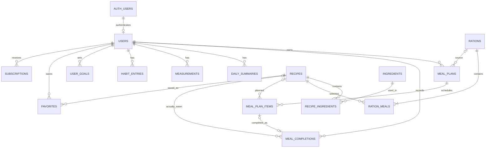

# Проект базы данных Supabase

Это проект первого этапа: SQL **не применён** ни к одному Supabase-проекту, frontend не изменён.

## Где что хранится — простыми словами

- **Каталог еды:** `recipes` хранит карточку и КБЖУ на одну порцию, `ingredients` — единый справочник продуктов, а `recipe_ingredients` — граммовки/единицы конкретного рецепта. Шаги, теги и аллергены остаются в рецепте. Обычный пользователь может читать доступные ему карточки, но не редактировать каталог.
- **Готовые рационы:** `rations` — описание дневной подборки, `ration_meals` связывает её ровно с четырьмя слотами: `breakfast`, `lunch`, `dinner`, `snack`.
- **Личный план:** одна строка `meal_plans` означает реальную календарную дату пользователя (`DATE`), а `meal_plan_items` содержит запланированный рецепт и число порций в каждом слоте. Поэтому «Сегодня» больше не сохраняется как текст и вычисляется frontend по `users.timezone`.
- **Факт и прогресс:** `meal_completions` отдельно фиксирует фактически съеденный рецепт, фактические порции и снимок КБЖУ на момент выполнения. `measurements` хранит замеры, `habit_entries` — шаги, воду и сон, `daily_summaries` — рассчитанный итог дня, `user_goals` — текущие цели.
- **Избранное и доступ:** `favorites` связывает пользователя с рецептом. `subscriptions` — источник истины о Premium: провайдер, статус и точные границы доступа. Клиент не может сам выдать себе подписку.
- **Идентичность:** внутренние связи используют UUID. `users.auth_user_id` связывает профиль с Supabase Auth, `telegram_user_id` хранит неизменяемый Telegram ID, а `legacy_id` сохраняет ID прототипа. Привязку Telegram следует делать только доверенной Edge Function после проверки `initData`, а не доверять данным браузера.

## ER-схема

`meal_completions` намеренно хранит snapshot КБЖУ. Если администратор позже исправит рецепт, исторический дневник пользователя не изменится задним числом.

## Безопасность и RLS

1. Все 15 таблиц имеют RLS. Личные политики сравнивают `user_id` с профилем текущего `auth.uid()`; дочерняя строка плана дополнительно проверяется через родительский план. Права `anon` явно отозваны.
2. Пользователь видит опубликованный бесплатный каталог и Premium-контент только при действующей `subscriptions` (`active`, начало наступило, окончание не наступило).
3. Для `recipes`, `ingredients`, `recipe_ingredients`, `rations`, `ration_meals` нет клиентских write-policy. Для `subscriptions` есть только чтение владельцем. Запись выполняет только backend с `service_role`.
4. Создание профиля и установка `auth_user_id`/`telegram_user_id` также остаются серверной операцией: клиенту не дана `INSERT`-policy на `users`, а обновлять разрешены только безопасные поля профиля (имя, username, locale и timezone).
5. `service_role` никогда не передаётся в Mini App. RLS — дополнительная защита, но backend всё равно обязан валидировать Telegram `initData` и платежный webhook.

## План переноса `recipes.ts` и `rations.ts`

Перенос следует сначала прогнать в отдельном Supabase preview/staging проекте.

1. Написать одноразовый TypeScript importer, который импортирует массивы без изменения исходных файлов и формирует JSON/CSV staging-артефакты.
2. Для каждого рецепта upsert по `legacy_id = recipe.id`. Перенести заголовок, описание, тип, source, время, шаги, теги, аллергены, Premium и media URL/path.
3. В текущих данных КБЖУ выглядит указанным **на весь выход рецепта** (есть многопорционные рецепты). После предметной проверки делить `calories`, `protein`, `fat`, `carbs` на `servings` и записывать в поля `*_per_serving`; исходный `servings` писать в `base_servings`. Импортер должен сформировать отчёт о нулевых/аномальных значениях и округлять только при записи до двух знаков.
4. Нормализовать имя ингредиента (trim, схлопывание пробелов, lowercase) и upsert в `ingredients` по `(normalized_name, category)`. Сохранить отображаемое имя. Для каждой позиции создать `recipe_ingredients`; стабильный legacy ID можно получить как `${recipe.id}:ingredient:${index}`. Нулевой `amount` допустим для «по вкусу».
5. Upsert рациона по `legacy_id = ration.id`, перенести `rationNumber`, тексты, теги, Premium, сортировку. `publishedAt` разобрать строго и записать календарной датой в `published_on`; неоднозначные/невалидные значения остановят импорт.
6. Для четырёх ключей `ration.meals` найти рецепт по legacy ID и создать `ration_meals`. Не создавать копии рецептов. Если вложенный объект отличается от каталога, вывести diff и вручную решить конфликт. Перенести индивидуальную картинку слота.
7. Загружать справочники транзакционно в порядке: recipes → ingredients → recipe_ingredients → rations → ration_meals. Повторный запуск должен быть идемпотентным. Сначала `is_published = false`, после проверок — отдельной админской транзакцией опубликовать.
8. Пользовательские `adaptedFrom` не импортировать как глобальный рацион: это будущий персональный `meal_plan` с изменённым `planned_servings`.

## План переноса изображений в Supabase Storage

1. Создать в staging публичный bucket `recipe-images` только для чтения и закрытый для клиентской записи. Загружает CI/importer через service role.
2. Собрать manifest: `legacy_id`, исходный локальный путь, SHA-256, MIME, размер, целевой ключ. Рекомендуемые ключи: `recipes/<recipe-uuid>/<hash>.<ext>` и `rations/<ration-uuid>/<hash>.<ext>`.
3. Проверить существование файла, MIME по содержимому, лимит размера, декодирование изображения и отсутствие дублей по SHA-256. Не перезаписывать разные файлы по одному ключу.
4. Загрузить оригиналы, при необходимости сгенерировать webp/avif thumbnail отдельным контролируемым job. Сверить количество и checksum после upload.
5. Записать **storage path**, а не подписанный URL, в `image_path`. Публичный URL строить из конфигурации; для будущего закрытого bucket выдавать короткоживущий signed URL.
6. Переключать данные на Storage только после smoke-test всех объектов. Старые файлы не удалять до отдельного подтверждённого этапа и резервной копии.

## Проверки целостности после миграции

Запросы находятся в [`supabase/checks/post_migration_checks.sql`](../supabase/checks/post_migration_checks.sql). Критерии приёмки:

- количества legacy ID совпадают с импортным manifest, дубликатов и потерянных FK нет;
- у каждого опубликованного рациона ровно четыре разных meal type;
- сумма рационов совпадает с суммой четырёх рецептов с учётом порций;
- даты имеют тип `DATE`, timezone проходит проверку `pg_timezone_names`;
- нет отрицательных КБЖУ/привычек и подписок с обратным диапазоном;
- anon ничего не читает, два тестовых authenticated пользователя не видят личные строки друг друга;
- обычный authenticated пользователь не может изменить рецепт или подписку; free-пользователь не читает Premium, Premium-пользователь читает;
- выборочно сопоставлены карточки, ингредиенты, КБЖУ и Storage checksum с TypeScript-источником.

## Secrets и frontend environment variables

### Supabase Secrets (только Edge Functions/backend)

- `TELEGRAM_BOT_TOKEN` — проверка подписи Telegram Mini App `initData`.
- `SUPABASE_SERVICE_ROLE_KEY` — onboarding, импорт каталога, webhook подписок; никогда не frontend.
- `PAYMENT_PROVIDER_SECRET_KEY` и `PAYMENT_WEBHOOK_SECRET` — условные имена, уточнить после выбора провайдера.
- `TELEGRAM_WEBHOOK_SECRET` — если используется Telegram webhook.
- `SENTRY_DSN` — опционально для серверных ошибок (без PII в breadcrumbs).

В Edge Functions `SUPABASE_URL` и `SUPABASE_ANON_KEY` обычно предоставляются платформой; их наличие нужно проверить в выбранном окружении. Миграционному CI нужны отдельные защищённые `SUPABASE_ACCESS_TOKEN`, `SUPABASE_PROJECT_ID` и пароль БД/connection string — не runtime frontend.

### Frontend (`VITE_*`, публичные по определению)

- `VITE_SUPABASE_URL`.
- `VITE_SUPABASE_ANON_KEY` (publishable/anon key, с RLS; не service role).
- `VITE_SUPABASE_RECIPE_IMAGES_BUCKET=recipe-images`.
- `VITE_TELEGRAM_BOT_USERNAME` — только если нужен публичный deep link.
- `VITE_SENTRY_DSN` — опциональный публичный browser DSN.

Ни bot token, ни service role, ни payment secret не должны иметь префикс `VITE_`.

## Применение и откат (в будущем)

- Forward migration: `supabase/migrations/202607200001_initial_schema.sql`.
- Явный rollback: `supabase/rollback/202607200001_initial_schema.down.sql`.
- До production: backup, staging run, проверки RLS под реальными JWT, review SQL и согласованное окно. Rollback удаляет таблицы и потому допустим только после backup; в рамках этого этапа он не запускается.
